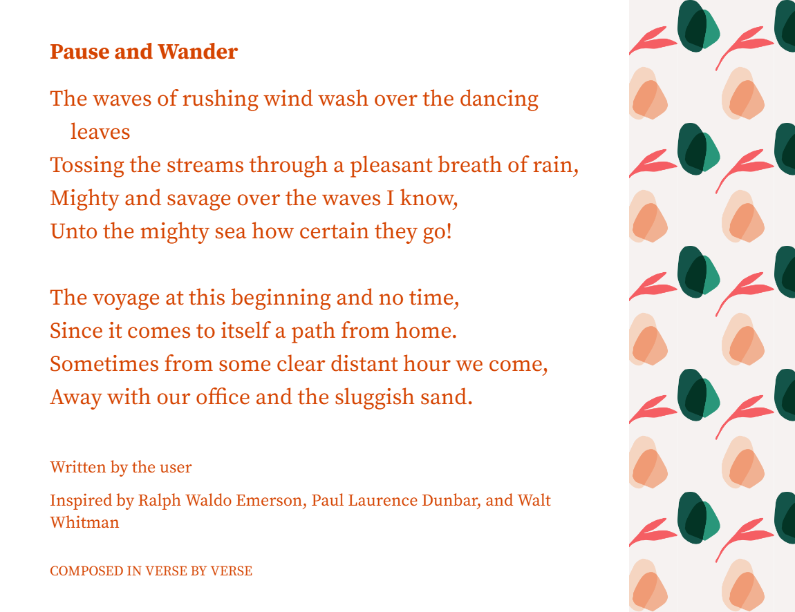
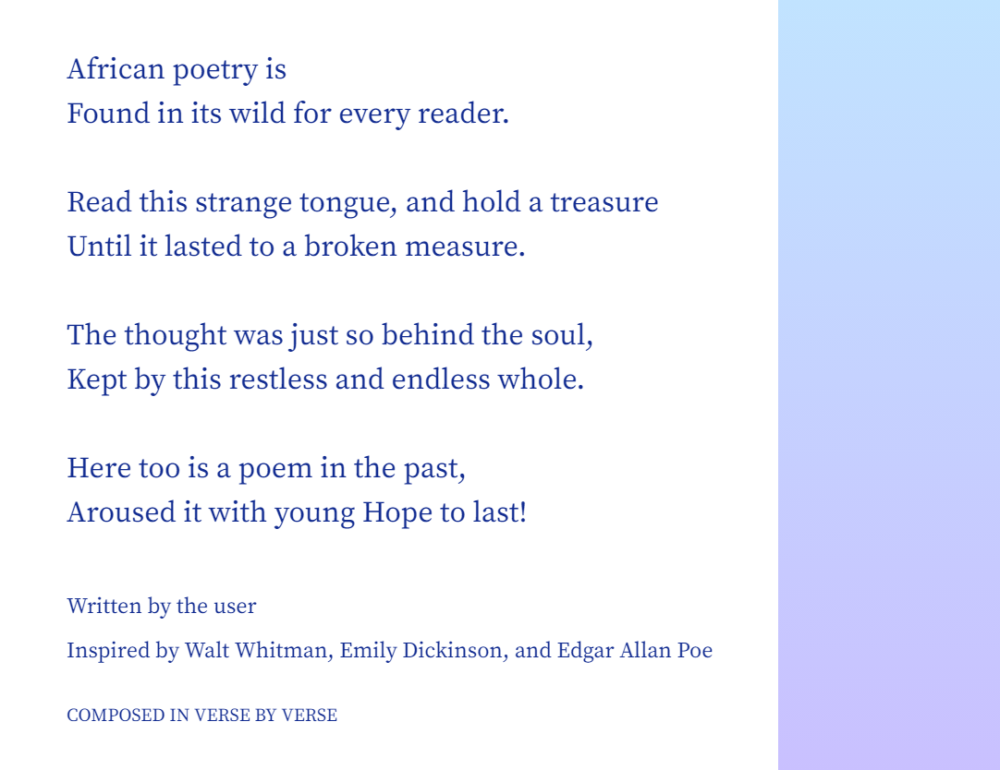

# Jidenka
Jide Nka is a conceptualized Artificial Intelligence platform, which will enable the machine creation of poems and stories within which African sensibilities and literary styles can be incorporated. The inspiration for this project came from the duo’s attempt at creating an African poem with the Google’s Verse by Verse artificial Intelligence platform. Although, the duo succeeded in creating two poems, yet they saw that their creation was overshadowed by western styles and sensibilities, hence the need for an artificial intelligence platform that could be dedicated to African literary creations. From an indigenous African language phrase that means “always hold on to creativity” or “always be creative,” Jide Nka machine learning model will enable the production of diverse literary creative styles that reflect the richness of the African literary landscape.

## Initial attempt - The African Robo Poems 

The two poems “Pause and Wander” and “The African Poetry is” herein called African Robo Poems  were composed by G.M.T Emezue using the Google AI platform [Verse by Verse](https://sites.research.google/versebyverse/). 

The process of producing an African poem via Google’s Verse by Verse AI platform was a very interesting and memorable experience. The instructions on how to select “muses,” (who were prominent American poets from different generations) were quite easy and simple t o follow. And at the input of the first line of poem, these “muses” will provide line suggestions, from which one is required to make a choice. 

Interestingly, since my objective was to write a poem, which while being universal, still reflected African worldview and sensibilities, I was initially startled when I encountered linguistic images that were alienated from the African environment and cultural norms. This is not surprising since a poet’s style is determined in part by the images associated with his/her poetic diction. Thus, since the muses were all non-African poets, it is not surprising that the poetic styles, images and sensibilities, which I encountered in Google’s Verse by Verse reflected western environment, cultural norms and experiences.  

After some effort, I was able to produce the poems “***Pause and Wander***” and “***African poetry is***” from the Google’s Verse by Verse AI platform. 

- - - -

- - - -

- - - -

Furthermore, although the two poems have very interesting poetic qualities, yet they cannot be called African poems, because of ***their inability to effectively reflect African images, sensibilities and world views***. These, among other issues inspired the duo [G.M.T Emezue](https://www.gmtemezue.com/) (a creative writer and critic) and [Chris Emezue](https://mila.quebec/en/person/chris-emezue/) to collaborate towards creating an AI platform called “JideNka” which will enable creative writers to create African Prose, Poem or drama. This is a work in progress.

## Model Setup 
Using a pre-trained Transformer-based language model, we will finetune it with the English translations of African folktales, African Oral poems, some written poems and written prose fiction (for which we have secured permission for third party usages). 

The choice of African oral poems and folktales stems from the fact that these genres of literature, which are dynamic in contemporary African settings are huge resources for sourcing African images, poetic expressions, styles, worldviews and sensibilities.

While these oral traditional genres also serve as great repositories for Africa’s poetic forms and structures, Africa’s prose fictional styles, their status as artifacts for communal heritage, render them as the best data source to be used for this project. 

Furthermore, the researches intend to scour the databases of many higher institutions in Africa, from where they hope to get the typed and English translations of these oral genres.  

